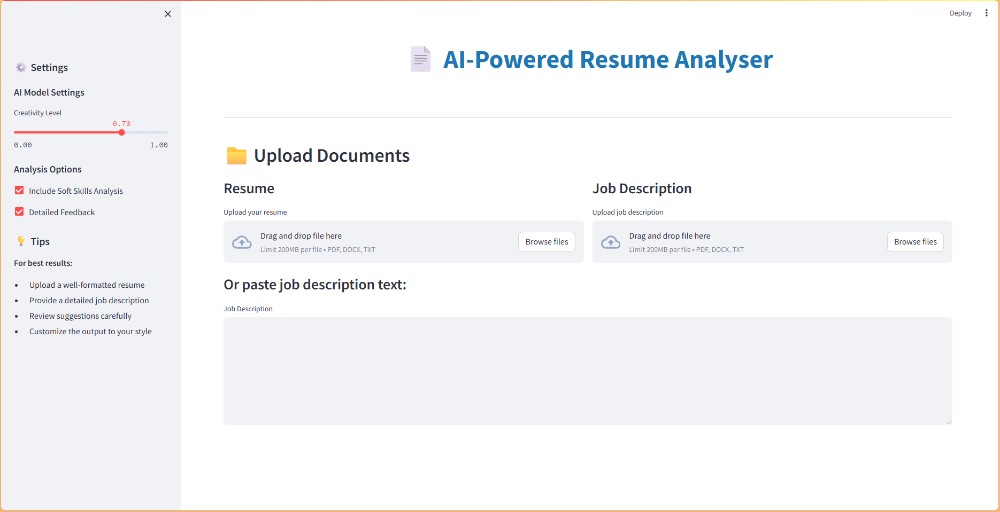

# 🤖 AI-Powered Resume Analyser

> **Transform your resume with AI-driven insights and land your dream job!**

An intelligent Streamlit application that uses **Google Gemini API** and **LangChain** to analyze resumes against job descriptions, providing personalized optimization recommendations and generating tailored resume versions.

[](https://streamlit.io/)
[](https://python.org/)
[](https://langchain.com/)
[](https://ai.google.dev/)

## ✨ Features

- 📄 **Multi-format Support** - Upload PDF, DOCX, or TXT files for resumes and job descriptions
- 🔍 **Intelligent Analysis** - AI-powered extraction of key requirements and keyword matching
- 📊 **Visual Insights** - Interactive charts showing match scores, gaps, and keyword analysis
- ✏️ **AI-Powered Tailoring** - Generate optimized resume versions using advanced prompts
- 💡 **Smart Suggestions** - Actionable recommendations for improving resume-job fit
- 📥 **Easy Export** - Download tailored resumes or copy content to clipboard
- 🎯 **Match Scoring** - Percentage-based compatibility scoring with detailed breakdowns
- 🔄 **Real-time Processing** - Live analysis with progress indicators

## 🎬 Demo



*Upload resume → Analyze with AI → Get tailored recommendations → Download optimized version*

## 🚀 Quick Start

### Prerequisites
- Python 3.8 or higher
- Google Gemini API key ([Get one free here](https://makersuite.google.com/app/apikey))

### Installation

1. **Clone the repository**
   ```bash
   git clone https://github.com/sohansputhran/ai-powered-resume-analyser.git
   cd ai-powered-resume-analyser
   ```

2. **Create virtual environment** (recommended)
   ```bash
   python -m venv venv
   
   # Activate virtual environment
   # Windows:
   venv\Scripts\activate
   # macOS/Linux:
   source venv/bin/activate
   ```

3. **Install dependencies**
   ```bash
   pip install -r requirements.txt
   ```

4. **Set up environment variables**
   ```bash
   # Create .env file and add your Google Gemini API key:
   # GOOGLE_API_KEY=your_actual_api_key_here
   ```

5. **Test your setup** (optional but recommended)
   ```bash
   python check_models.py
   ```
   This will verify your API key and show available models.

6. **Run the application**
   ```bash
   streamlit run app.py
   ```

The application will open in your browser at `http://localhost:8501`

## 🎯 How It Works

### 1. **Upload Documents**
- Upload your resume (PDF, DOCX, or TXT)
- Upload job description or paste the text directly
- Files are validated and text is extracted automatically

### 2. **AI Analysis Pipeline**
- **Job Analysis**: Extract key skills, requirements, and qualifications
- **Resume Analysis**: Match keywords, identify gaps, calculate compatibility score
- **Comparison**: Generate detailed insights on strengths and missing elements

### 3. **Get Results**
- **Match Score**: Overall percentage compatibility
- **Keyword Analysis**: Visual breakdown of matched vs missing keywords
- **Detailed Insights**: Strengths, gaps, and improvement areas
- **Tailored Resume**: AI-optimized version of your resume

### 4. **Export & Use**
- Download the tailored resume as TXT
- Copy specific sections to clipboard
- Use suggestions to manually improve your original resume

## 📊 Analysis Features

### Job Description Analysis
- Technical skills extraction
- Soft skills identification
- Experience level requirements
- Education requirements
- Key responsibilities parsing

### Resume Evaluation
- Keyword matching with synonyms
- Skills gap identification
- Experience alignment assessment
- Education compatibility check
- ATS-friendly formatting suggestions

### AI-Powered Tailoring
- Content optimization for specific roles
- Keyword integration without stuffing
- Achievement highlighting
- Section reordering for relevance
- Professional language enhancement

## 🛠️ Tech Stack

- **Frontend**: Streamlit with custom CSS styling and responsive design
- **AI/ML**: Google Gemini 1.5 Flash, LangChain for prompt orchestration
- **File Processing**: PyPDF2, python-docx for multi-format document parsing
- **Visualization**: Plotly for interactive charts and metrics
- **Backend**: Python with modular service architecture
- **Configuration**: Environment-based settings with validation

## 📁 Project Structure

```
ai_resume_analyser/
├── app.py                      # Main Streamlit application
├── requirements.txt            # Python dependencies
├── .env.example               # Environment variables template
├── check_models.py            # Model availability checker
├── config/
│   └── settings.py            # Configuration settings
├── services/
│   ├── gemini_service.py      # Gemini API integration
│   ├── langchain_service.py   # LangChain prompt orchestration
│   └── resume_processor.py   # Text analysis and processing
├── utils/
│   └── file_handler.py        # File upload and text extraction
└── templates/
    └── prompts.py             # AI prompt templates
```

## 🎨 Customization

### Adjusting AI Behavior
Edit `templates/prompts.py` to customize:
- Analysis depth and focus areas
- Output format and structure
- Industry-specific terminology
- Scoring criteria

### UI Customization
Modify `config/settings.py` for:
- Theme colors and styling
- File size limits
- Analysis thresholds
- Feature toggles

### Adding New Features
The modular architecture makes it easy to:
- Add new file formats
- Integrate additional AI models
- Implement new export formats
- Create custom analysis metrics

## 📋 Example Use Cases

- **Job Seekers**: Optimize resumes for specific positions and industries
- **Career Coaches**: Provide data-driven, objective resume feedback
- **HR Professionals**: Understand skill gaps in candidate applications
- **Students**: Learn what employers look for in entry-level resumes
- **Career Changers**: Adapt existing experience for new industries

## 🔧 Troubleshooting

### Common Issues

**"API Key Not Found"**
- Ensure `.env` file exists in the root directory
- Verify `GOOGLE_API_KEY` is set correctly
- Check that the API key is valid and active

**"Model Not Found" Error**
- Run `python check_models.py` to see available models
- Update model name in `config/settings.py`
- Ensure you have the latest `google-generativeai` package

**"No Text Extracted"**
- For PDFs: File might be image-based (scanned document)
- For DOCX: File might be corrupted or password-protected
- Try converting to TXT format or use OCR tools first

**"File Upload Failed"**
- Check file size (default limit: 10MB)
- Ensure file format is supported (PDF, DOCX, TXT)
- Verify file isn't corrupted

### Performance Tips

1. **Optimize Documents**
   - Keep resumes under 2 pages
   - Use standard fonts and formatting
   - Avoid complex layouts or images

2. **API Usage**
   - Free tier has daily limits
   - Monitor usage in [Google AI Studio](https://makersuite.google.com)
   - Consider upgrading for heavy usage

## 🤝 Contributing

Contributions are welcome! Here's how to get started:

1. Fork the repository
2. Create a feature branch (`git checkout -b feature/amazing-feature`)
3. Make your changes
4. Add tests if applicable
5. Commit your changes (`git commit -m 'Add amazing feature'`)
6. Push to the branch (`git push origin feature/amazing-feature`)
7. Open a Pull Request

### Development Setup
```bash
# Install development dependencies
pip install -r requirements.txt
```

## 📄 License

This project is licensed under the MIT License - see the [LICENSE](LICENSE) file for details.

## 🙏 Acknowledgments

- Google AI for providing the Gemini API
- Streamlit team for the amazing framework
- LangChain for prompt orchestration tools
- The open-source community for various libraries used

## ⚠️ Requirements & Limitations

### System Requirements
- Python 3.8+
- Internet connection for AI analysis
- Google Gemini API key (free tier available)

### Current Limitations
- Maximum file size: 10MB per file
- PDF processing limited to 10 pages
- Text-based analysis only (no image processing)
- Free API tier has daily usage limits

## 🔮 Roadmap

- [ ] Support for additional file formats (DOC, RTF)
- [ ] Batch processing for multiple resumes
- [ ] Integration with job boards APIs
- [ ] Advanced analytics and reporting
- [ ] User accounts and history
- [ ] Custom industry templates
- [ ] Multi-language support

---

**Made with ❤️ using Streamlit and Google AI**

*Helping job seekers optimize their resumes with the power of artificial intelligence!*

---

## 📞 Support

If you encounter any issues or have questions:

1. Check the [Issues](https://github.com/sohansputhran/ai-powered-resume-analyser/issues) page
2. Run `python check_models.py` to debug API issues
3. Review the troubleshooting section above
4. Create a new issue with detailed information

**Star ⭐ this repository if it helped you land a better job!**
